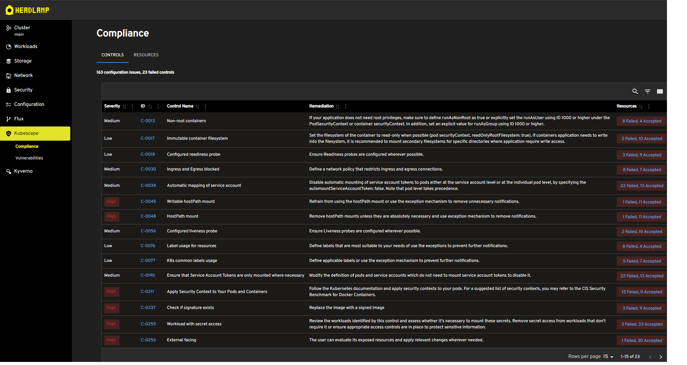

# Kubescape Headlamp Plugin

This project provides an open source Kubescape plugin for Headlamp. It builds upon the work of [Kubescape](https://kubescape.io/) and [Headlamp](https://github.com/headlamp-k8s/headlamp).

The purpose of the plugin is to assist in the overall use cases for Kubescape, as documented [here](https://kubescape.io/).
The plugin will build extra menuitems in Headlamp for configuration and image scanning.

The plugin is yet in alpha status and should not be used in production.

## Demo

## Prerequisites

- [Kubescape operator](https://kubescape.io/docs/operator/) should be installed in the k8s cluster and enabled for configuration and image scanning.
- [Headlamp](https://github.com/headlamp-k8s/headlamp) should be installed in the k8s cluster or workstation

The plugin code has been tested with Headlamp v0.25.0 and kubescape v0.2.6.

## Installation

TODO

## Dependencies

- The plugin depends on documenation of configuration scanning in [Kubescape User Hub](https://hub.armosec.io/docs/controls).
- The plugin depends on JSON documentation in the [kubescape regolibrary](https://github.com/kubescape/regolibrary/releases/download/v2/controls/). The [control libary](./src/ConfigurationScanning/controlLibrary.js) is copied for use in the plugin code.

## Kubescape datamodel

Kubescape provides several reporting objects that can be retrieved via the K8s API server.

| Object                           | Namespaced | List with details | Description                                                          | References                                          |
| -------------------------------- | ---------- | ----------------- | -------------------------------------------------------------------- | --------------------------------------------------- |
| ConfigurationScanSummary         | No         | Yes               | Count of severities per namespace                                    | refers to multiple WorkloadConfigurationScanSummary |
| VulnerabilityManifest            | kubescape  | No                | image scan result                                                    |
| VulnerabilityManifestSummary     | Yes        | No                | Summary of VulnerabilityManifest                                     | Refers to vulnerabilitymanifests                    |
| VulnerabilitySummary             | No         | Yes               | Count of severities per namespace                                    | refers to multiple VulnerabilityManifestSummary     |
| WorkloadConfigurationScan        | Yes        | No                | configuration scan result of a workload showing controls with status | refers to single WorkloadConfigurationScanSummary   |
| WorkloadConfigurationScanSummary | Yes        | No                | summary of WorkloadConfigurationScan with count of severities        | refers to single WorkloadConfigurationScan          |

The list queries do not provide details but only metadata. This makes it challenging for the GUI. As a workaround the plugin makes multiple calls to individual resources.

WorkloadConfigurationScan and VulnerabilityManifest provide most of the information.

Kubescape uses API aggregation, so there are no CRDs: https://github.com/kubescape/storage. For development purposes the specs are retrieved with `kubectl explain --recursive` and saved in the folder [v1beta1](v1beta1).

## Technical Issues

- ConfigurationScanSummary and VulnerabilitySummary are returned by Kubescape without UID in the metadata. This makes it harder to retrieve these objects with the HeadLamp api proxy, because the retrieved list is put in a map by UID. As a workaround we use ApiProxy.request() instead of useApiList().
- Overview pages for Image and Configuration issues make a lot of K8s calls, because the list queries cannot be used. This might become an issue for big clusters. Maybe we can improve a bit by caching.

## Contributing

Contributions are welcome! Please fork the repository and submit a pull request.

## License

This project is licensed under the Apache-2.0 License. See the LICENSE file for details.

## Contact

For any questions or feedback, please open an issue on the GitHub repository.
